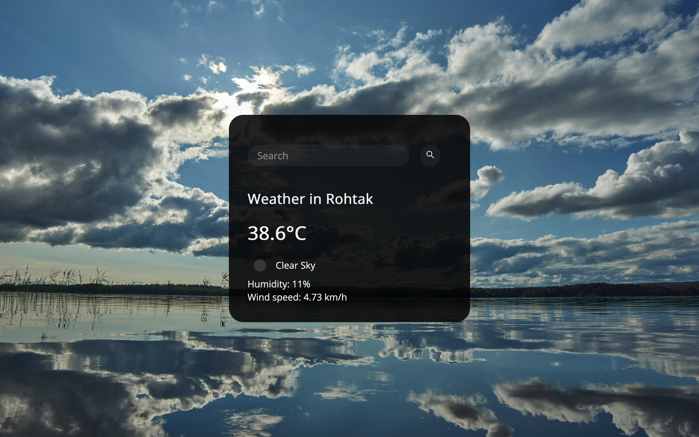

# weather-website-demo
A simple website that displays the temperature, weather, humidity and wind speed in the area you type.

# Weather Application

This is a simple weather application that fetches weather data from the OpenWeatherMap API and displays it. The application allows users to search for the weather in different cities.

## Table of Contents
- [Demo](#demo)
- [Features](#features)
- [Technologies Used](#technologies-used)
- [Installation](#installation)
- [Usage](#usage)
- [Project Structure](#project-structure)
- [Contributing](#contributing)
- [License](#license)

## Demo


## Features
- Search for current weather in any city
- Display temperature, humidity, and wind speed
- Responsive design

## Technologies Used
- HTML
- CSS
- JavaScript
- OpenWeatherMap API

## Installation

1. Clone the repository:
    ```sh
    git clone https://github.com/garvit-exe/weather-app.git
    cd weather-app
    ```
    
2. Createyour own openweathermap API Key by visiting [openweathermap.org](https://home.openweathermap.org/api_keys)

3. Create `apikey.js` file in `assets/js`:
    ```sh
    touch assets/js/apikey.js
    ```

    Add the following code to `apikey.js`:
    ```javascript
    const WEATHER_API_KEY = "your-openweathermap-api-key";
    export default WEATHER_API_KEY;
    ```

    Replace `your-openweathermap-api-key` with your own openweathermap API Key.
   
    Ensure `apikey.js` is in `.gitignore` to keep your API key secure.

## Usage

1. Start a local server to view the application. You can use [Live Server](https://marketplace.visualstudio.com/items?itemName=ritwickdey.LiveServer) in VSCode or any other local server tool.

2. Open `index.html` in your browser:
    ```sh
    open index.html
    ```

3. Enter the name of a city in the search bar and click the search button or press `Enter`.

## Project Structure

- weather-website-demo/
  - assets/
    - css/
      - style.css
    - images/
      - bgImage.jpg
    - js/
      - apikey_sample.js
      - script.js
  - index.html
  - .gitignore
  - LICENSE
  - README.md

### Detailed Explanation

- **index.html**: The main HTML file containing the structure of the app.
- **assets/css/style.css**: The CSS file for styling the app.
- **assets/images/**: Contains various images used in the app.
- **assets/js/script.js**: The JavaScript file containing the logic for fetching and displaying weather data.
- **assets/js/apikey_sample.js**: A sample file showing how to set up the API key.
- **.gitignore**: A file to exclude sensitive files like `apikey.js` from being committed to the repository.

## Contributing

Contributions are welcome! Please fork the repository and create a pull request with your changes. 

1. Fork the repository.
2. Create your feature branch: `git checkout -b my-new-feature`
3. Commit your changes: `git commit -m 'Add some feature'`
4. Push to the branch: `git push origin my-new-feature`
5. Create a new Pull Request.

## License

This project is licensed under the MIT License. See the [LICENSE](LICENSE) file for more information.
